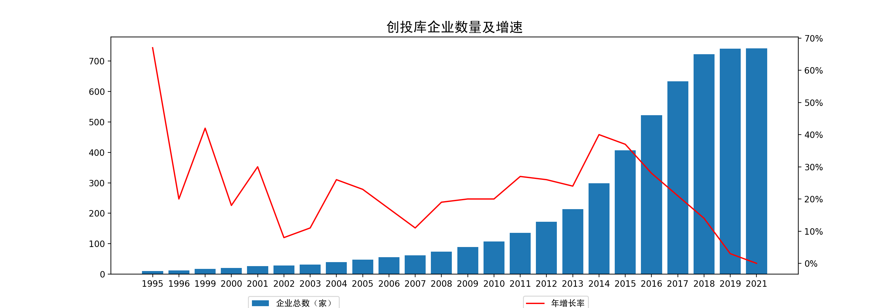

# Qichacha 企查查创投库数据获取自动化
## 自动化
企查查的防爬很厉害，所以只能是利用代码自动化一些复制粘贴的程序。   

极验（Geetest）还是得手动，要留意定时跳出的验证框。

## 数据准确度
数据中仍存在不及时、不准确、重复的信息。

## 代码
场景：获得**养老**行业的公司信息

## 其他代码存档
1. 数据处理_不爬网.py - 得到自己关注机构的投融资事件
2. 投资项目词云_old.py - 创建投资项目词云（输入为主营业务概述的excel表格）   
    相关附件：  
    - 月度主营业务汇总_sample.xlsx
    - cn_stopwords_sample.txt    
    - unicorn_sample.jpg
3. 数据处理可视化_old.py - 原始版本数据处理，可视化为投融资事件热力图

## 可视化sample
1. 企业数量增速可视化

2. 融资轮次及金额可视化(上市公司数据经调整)

3. 企业分布可视化

网页版动态文件：养老相关品牌产品地区分布.html

4. 词云

